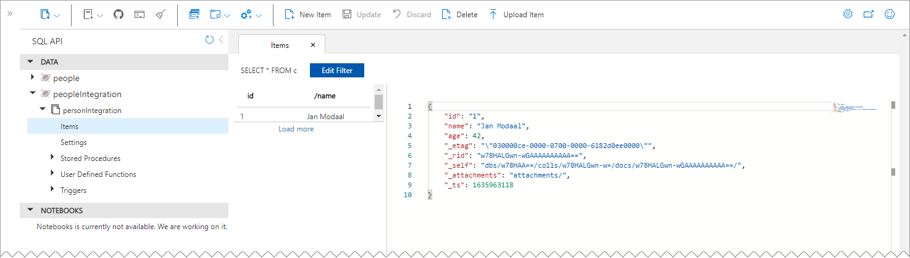
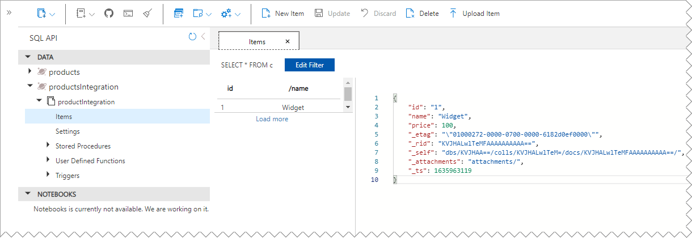

# Azure Spring Data Cosmos DB Multiple Account (CDBMA) Sample

This sample demonstrates a way to have a single Spring Boot application connect to two separate Azure Cosmos DB Core SQL api databases.

The standard method using the `AbstractCosmosConfiguration` class works fine for a single database, but fails when you try to create two separate configurations because the `AbstractCosmosConfiguration` methods have no way of specifying which beans from the config classes should be used. 

The solution used here is to directly inherit from the same `CosmosConfigurationSupport` base class that `AbstractCosmosConfiguration` inherits, and simply re-implement the little bit that `AbstractCosmosConfiguration` added.  Ideally, there is a cleaner way to do this, without having to repeat so much code, but at least this works. 

## To run the code:
1. Have Java 11 and Maven installed and configured properly on your system
2. [Create](https://docs.microsoft.com/en-us/azure/cosmos-db/sql/create-cosmosdb-resources-portal), or identify two Azure Cosmos DB Core SQL Api Accounts that you can use, and that you can create new databases and containers on.
3. Clone this repo [Cosmos DB Multiple Account (CDBMA) Practice Repo](https://github.com/BretStateham/AzureCosmosSpringDataMultipleAccounts)
4. Open the project in the IDE of your choice (It was developed in IntelliJ Community Edition)
5. Copy the [src/main/resources/application-dev.properties.example](src/main/resources/application-dev.properties.example) file to a new file n the same directory named `application-dev.properties` (without "`example`" at the end)
6. Copy the [src/test/resources/integration-tests.properties.example](src/test/resources/integration-tests.properties.example) file to a new file n the same directory named `integration-tests.properties` (without "`example`" at the end)
7. Update the two `.properties` files you just copied and supply the appropriate `HTTPS` endpoints and primary key values for both accounts in both files.
8. From a terminal window in the root directory of the repo, run the following command:
    > **Note**: If you prefer to run the test in your IDE, go for it.

    > **WARNING!!!** Running the integration tests will delete all data in the integration test target containers and databases before testing the ability to write to them.  Make sure that the [src/test/resources/integration-tests.properties](src/test/resources/integration-tests.properties) properties are configured to use the correct databases and containers. 

    ```shell
    mvn verify -DskipIntegrationTests=false
    ```

    And verify that the results passed:

    ```shell
   ...
   [INFO] Results:
   [INFO]
   [INFO] Tests run: 6, Failures: 0, Errors: 0, Skipped: 0
   [INFO]
   [INFO]
   [INFO] --- maven-failsafe-plugin:3.0.0-M5:verify (default) @ cdbma ---
   [INFO] ------------------------------------------------------------------------
   [INFO] BUILD SUCCESS
   [INFO] ------------------------------------------------------------------------
   [INFO] Total time:  23.105 s
   [INFO] Finished at: 2021-11-03T11:04:28-07:00
   [INFO] ------------------------------------------------------------------------
    ```
9. In addition, you can open the target database Data Explorers in the Azure Portal and verify that the test entities were saved:

   

   